<!-- rmarkdown v1 -->

## Geographic representation of (linguistic/frequency) data with `ggplot2` and shapefiles
### *Kristel Uiboaed*
#### *May 16, 2016*
##### Code and data: [https://github.com/kristel-/spatial-visualization-with-r](https://github.com/kristel-/spatial-visualization-with-r)

Packages needed to run the whole script.

```r
library("rgdal")
library("rgeos")
library("maptools")
library("ggplot2")
library("plyr")
library("dplyr")
library("ggmap")
library("stringi")
library("gridExtra")
library("splitstackshape")
```

First, you need to read in the shapefile. Shapefile files are in a separate folder (*estParishDialects*) in the working directory, the shapefile is named *estParishDialects*. Read in the shapefile with `readOGR` in **`rgdal`** package. The shapefile folder is in the working directory, otherwise specify the path to the shapefile folder.


```r
estParishData <- readOGR("./estParishDialects", "estParishDialects")
```

```
## OGR data source with driver: ESRI Shapefile 
## Source: "./estParishDialects", layer: "estParishDialects"
## with 120 features
## It has 12 fields
```

```r
plot(estParishData)
```

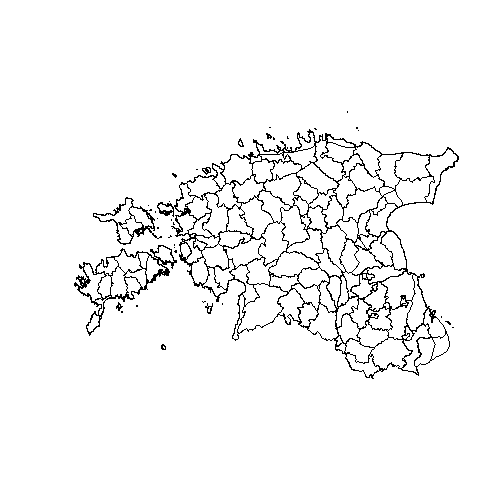

```r
summary(estParishData)
```

```
## Object of class SpatialPolygonsDataFrame
## Coordinates:
##         min       max
## x  369020.1  739155.1
## y 6377140.8 6634005.5
## Is projected: TRUE 
## proj4string :
## [+proj=lcc +lat_1=58 +lat_2=59.33333333333334
## +lat_0=57.51755393055556 +lon_0=24 +x_0=500000 +y_0=6375000
## +ellps=GRS80 +units=m +no_defs]
## Data attributes:
##     OBJECTID            ID           Parish_id          Name    
##  Min.   :  1.00   Min.   :  1.00   Amb    :  1   Iisaku   :  3  
##  1st Qu.: 30.75   1st Qu.: 30.75   Ann    :  1   Haljala  :  2  
##  Median : 60.50   Median : 60.50   Ans    :  1   Jõelähtme:  2  
##  Mean   : 60.50   Mean   : 60.50   Aud    :  1   Kuusalu  :  2  
##  3rd Qu.: 90.25   3rd Qu.: 90.25   Avi    :  1   Laiuse   :  2  
##  Max.   :120.00   Max.   :120.00   Emm    :  1   Palamuse :  2  
##                                    (Other):114   (Other)  :107  
##          Ger_name  
##  Isaak       :  3  
##  St. Johannis:  3  
##  Haljall     :  2  
##  Jeglecht    :  2  
##  Kusal       :  2  
##  (Other)     :104  
##  NA's        :  4  
##                                                                            Comment  
##  Katastripiiride põhjal üle kontrollitud (P. Päll, 2013-01-15)                 :11  
##  Kihelkonnapiirid mõisapiiride järgi üle kontrollitud (Peeter Päll, 2012-11-26): 8  
##  Võru Instituudi andmed (Evar Saar)                                            : 8  
##  Kihelkonnapiirid mõisapiiride järgi üle kontrollitud (Peeter Päll, 2012-12-17): 7  
##  Kihelkonnapiirid mõisapiiride järgi üle kontrollitud (Peeter Päll, 2012-11-12): 6  
##  (Other)                                                                       :76  
##  NA's                                                                          : 4  
##                                                                       Problem   
##  Naissaar kuulus Tallinna alla (siin Jõe)                                 :  2  
##  Piir Tormaga pole kindel                                                 :  2  
##  Emmaste-Käina piir pole päris kindel; püütud on ühtlustada mõisapiiridega:  1  
##  Karunga kuulub 1871krt järgi pigem Rakvere khk-a                         :  1  
##  Kihelkonna põhiosa (sh kirik) asub prg Läti poolel                       :  1  
##  (Other)                                                                  :  9  
##  NA's                                                                     :104  
##    Shape_Leng       Dialect_en   Shape_Le_1       Shape_Area       
##  Min.   : 26172   Mid    :38   Min.   : 22587   Min.   :1.190e+07  
##  1st Qu.:110232   Western:22   1st Qu.:107592   1st Qu.:2.462e+08  
##  Median :139558   Insular:18   Median :131896   Median :3.673e+08  
##  Mean   :147772   Tartu  :11   Mean   :137415   Mean   :4.004e+08  
##  3rd Qu.:164614   Võru   : 8   3rd Qu.:158557   3rd Qu.:5.288e+08  
##  Max.   :394865   Eastern: 7   Max.   :364986   Max.   :1.226e+09  
##                   (Other):16                                       
##    Dialect_et
##  Kesk   :38  
##  Lääne  :22  
##  Saarte :18  
##  Tartu  :11  
##  Võru   : 8  
##  Ida    : 7  
##  (Other):16
```

Check the coordinate system.


```r
estParishData@proj4string
```

```
## CRS arguments:
##  +proj=lcc +lat_1=58 +lat_2=59.33333333333334
## +lat_0=57.51755393055556 +lon_0=24 +x_0=500000 +y_0=6375000
## +ellps=GRS80 +units=m +no_defs
```

Convert the CRS (*coordinate reference system*) for further processing, if necessary. E.g. NAD83 and WGS84 are compatible with our corpus geodata.


```r
estParish <- spTransform(estParishData, CRS("+proj=longlat +datum=NAD83"))
```


```r
head(estParish@data)
```

The shapefile contains the column which marks the dialect area of the parishes.
Now we can create a separate layer for dialects and we join data by Dialect_en variable.
All rows with the same value are joined to one polygon. Dialect is an id in the function call `gUnaryUnion` (**`rgeos`** package).


```r
dialects <- gUnaryUnion(estParish, id = estParish$Dialect_en)
plot(dialects)
```

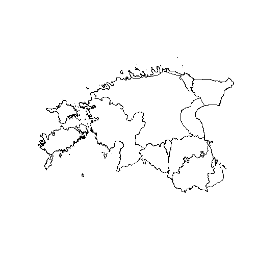


```r
summary(dialects)
gIsValid(dialects)
```

Here is how to join dialects with shapefile attribute table, if dialects were not included in shapefile attribute table.
The parish-dialect data is in *parish-dialect.csv*.


```r
parish.dialect <- read.csv2(file="parish-dialect.csv", header=T)
head(parish.dialect)
```

```
##   Parish_id Dialect_en
## 1       Vor    Western
## 2       Muh    Insular
## 3       Khn    Insular
## 4       Ruh    Insular
## 5       Jaa    Insular
## 6       Vll    Insular
```

```r
estParish@data <- data.frame(estParish@data, parish.dialect[match(estParish@data$Parish_id, parish.dialect$Parish.Dialect),])
```

Plot two layers (parishes and dialects) on top of each other.


```r
plot(estParish, border="grey")
plot(dialects, add=TRUE)
```

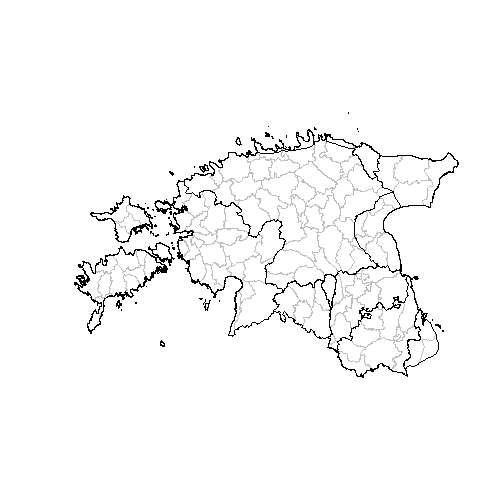

Retrieve the centroids of polygons to be used for labeling, use `gCentroid` from **`rgeos`**.
*byid=TRUE* specifies that the centroid for every polygon will be retrieved not just one centroid for the whole map.
Label positions can also be in a separate dataframe with specific coordinates (e.g. label positions don't necessarly need to be centroids).


```r
parish.centr <- gCentroid(estParish, byid=TRUE)
plot(estParish, border="grey", lty="dotted")
plot(dialects, add=TRUE)
text(x = parish.centr$x, y = parish.centr$y, labels = as.character(estParish$Parish_id), cex=0.75)
```

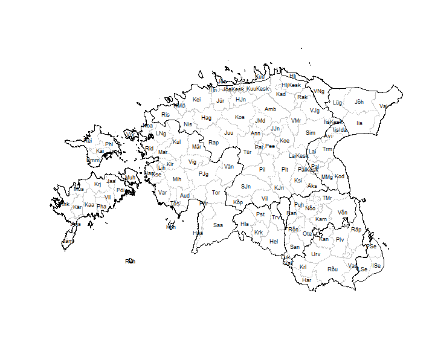

Create a dataframe from a shapefile, which is necessary for plotting with **`ggplot2`**:


1. for parishes, id is the *Parish_id* column (parish abbreviations), the parish identifier.
2. for dialects, id is the *Dialect_en* column.


```r
parish.df <- fortify(estParish, region="Parish_id")
dialect.df <- fortify(estParish, region="Dialect_en")
```


```r
head(parish.df)
```

```
##       long      lat order  hole piece  id group
## 1 25.75987 59.38331     1 FALSE     1 Amb Amb.1
## 2 25.76030 59.38310     2 FALSE     1 Amb Amb.1
## 3 25.76066 59.38274     3 FALSE     1 Amb Amb.1
## 4 25.76107 59.38251     4 FALSE     1 Amb Amb.1
## 5 25.76141 59.38219     5 FALSE     1 Amb Amb.1
## 6 25.76145 59.38192     6 FALSE     1 Amb Amb.1
```

```r
head(dialect.df)
```

```
##       long      lat order  hole piece      id     group
## 1 26.77891 59.49544     1 FALSE     1 Coastal Coastal.1
## 2 26.77851 59.49555     2 FALSE     1 Coastal Coastal.1
## 3 26.77756 59.49573     3 FALSE     1 Coastal Coastal.1
## 4 26.77697 59.49575     4 FALSE     1 Coastal Coastal.1
## 5 26.77667 59.49576     5 FALSE     1 Coastal Coastal.1
## 6 26.77667 59.49558     6 FALSE     1 Coastal Coastal.1
```


```r
str(parish.df)
str(dialect.df)
```

Change the *id*-column names in dataframes.
*fortify* changes the *id* column name automatically to *id*. Changing the name is not necessary, but makes it easier to merge other tables.


```r
names(parish.df)[names(parish.df)=="id"] <- "Parish_id"
names(dialect.df)[names(dialect.df)=="id"] <- "Dialect_en"
```

Check the plotting.


```r
ggplot(data = parish.df, aes(long, lat, group = group)) + geom_polygon(colour="grey", fill="white") + theme_bw() 
```

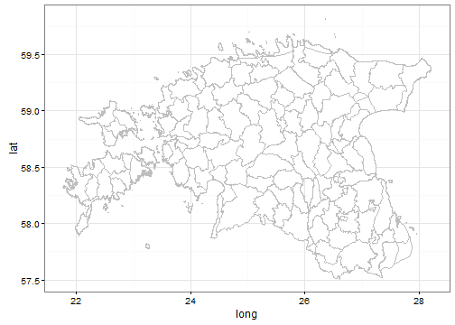

```r
ggplot(data = dialect.df, aes(long, lat, group = group)) + geom_polygon(colour="grey", fill="white") + theme_bw()
```

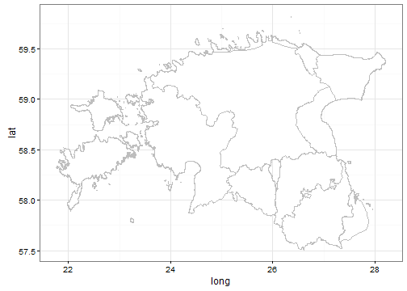

Create the axis theme for map plotting (to avoid typing it in every map script).


```r
mapAxisTheme <- theme(panel.grid.major = element_blank(),
                      panel.grid.minor = element_blank(),
                      axis.ticks = element_blank(),
                      axis.text.x = element_blank(),
                      axis.text.y = element_blank())
```


Plot the dialect map from the dialect dataframe with **`ggplot2`**.


```r
ggplot(data = dialect.df, aes(x = long, y = lat)) +
          geom_polygon(aes(group = group , fill = Dialect_en), colour = 'grey',
                       alpha = .5,
                       show.legend=FALSE) +
          scale_fill_brewer(palette="Set3") +
          labs(x = "", y = "") +
          theme_bw() +
          mapAxisTheme +
          guides(fill=FALSE)
```

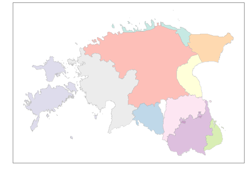

Now we create a list of labels for plotting dialect names on the map.We proceed with plotting both dialects and parishes at the same time.
First, we create an id-list with parish name abbreviations (not necessary for dialects).


```r
idListPar <- estParish@data$Parish_id
```

*coordinates* extracts centroids of the polygons, in the order listed in *estParish@data* (shapefile attribute table).
First, we extract centroids for dialect polygons and then for parish polygons.
For dialects, we use the previously created layer *dialects*.
We addtionally create a separate column from rownames for the dialect column (dialects and estParish are different datatypes). We can use this dataframe for plotting the dialects later. For parishes we continue with some extra steps.


```r
centroidsDial <- as.data.frame(coordinates(dialects))
names(centroidsDial) <- c("Longitude", "Latitude")  # change to meaningful column names in centroid dataframe
centroidsDial$Dialect <- rownames(centroidsDial)
```


```r
centroidsPar <- as.data.frame(coordinates(estParish))
names(centroidsPar) <- c("Longitude", "Latitude")  # change to meaningful column names in centroid dataframe
```

Join the centroid of the polygon with the corresponding parish name.


```r
centrPar.id <- data.frame(id=idListPar, centroidsPar)
parWithCentr <- merge(parish.df, centrPar.id, by.x="Parish_id", by.y="id")
```

Plot the map with parish abbreviations with **`ggplot2`**.


```r
ggplot(data = parWithCentr, aes(x = long, y = lat, group = group)) +
          geom_polygon(aes(group = group), colour = 'grey', fill="yellowgreen",
                       alpha = .5,
                       show.legend=FALSE) +
          labs(x = "", y = "") +
          theme_bw() +
          mapAxisTheme +
          geom_text(aes(label = Parish_id, x = Longitude, y = Latitude, size=2.5), show.legend=FALSE, check_overlap = TRUE) +
          guides(fill=FALSE)
```

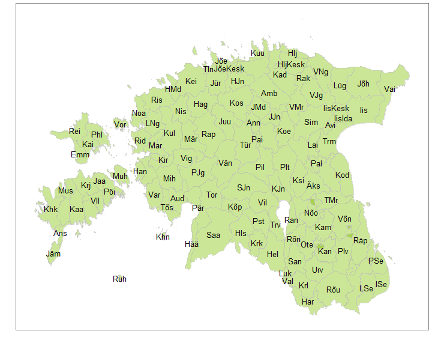

Plot the map with dialect names on dialect polygons.


```r
ggplot(data = dialect.df, aes(x = long, y = lat)) +
          geom_polygon(aes(group = group , fill = Dialect_en), colour = 'grey',
                       alpha = .4,
                       size = .1,
                       show.legend=FALSE) +
          scale_fill_brewer(palette="Set3") +
          labs(x = "", y = "") +
          theme_bw() +
          mapAxisTheme +
          geom_text(data = centroidsDial, aes(x = Longitude, y = Latitude, label = Dialect), size = 3) +
          guides(fill=FALSE)
```

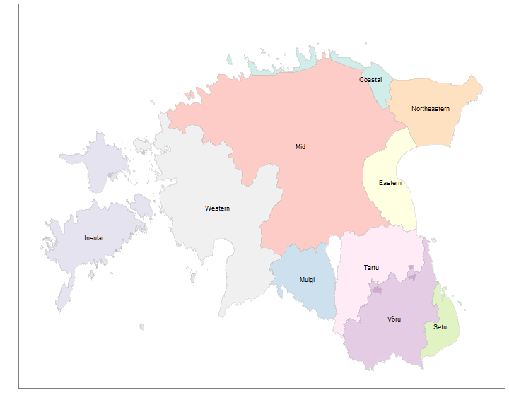

Plot dialects and parishes on the same map with **`ggplot2`**.


```r
ggplot() +
          geom_polygon(data=dialect.df, aes(x=long, y=lat, group=group, fill=Dialect_en), colour='white', alpha=.2, size =.4, show.legend=F) +
          geom_polygon(data=parish.df, aes(x=long, y=lat, group=group), colour='black', fill='white', alpha=.2, size=.1) +
          labs(x = "", y = "") +
          theme_bw() +
          mapAxisTheme +
          geom_text(data  = parWithCentr, aes(x = Longitude, y = Latitude, label = Parish_id), size = 3.5, check_overlap=TRUE) +
          guides(fill=FALSE)
```

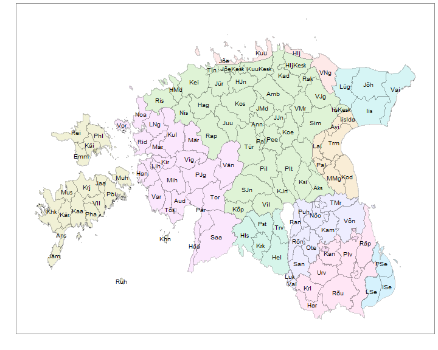

Now we read in the verb frequency data from the file *parish-verb-frequencies.csv*.


```r
parishVerbFreq <- read.csv2(file="parish-verb-frequencies.csv")
head(parishVerbFreq)
```

```
##   Parish_id VerbFreqParish
## 1       Mar           5807
## 2       Amb           3100
## 3       Ans           2427
## 4       Avi           1494
## 5       Emm           2281
## 6       Har           3313
```

Merge the verb frequency data with the shapefile attribute table, keep all parishes, even if the information from the parish is missing or the verb frequency is 0. Parishes with no information get NA value, which we replace with zeros for plotting (otherwise we would get empty "holes" without borders on the map).


```r
estParishesVerbs <- merge(estParish@data, parishVerbFreq, by="Parish_id", all.x=T, all.y=T, sort=F)
head(estParishesVerbs)
```

```
##   Parish_id OBJECTID ID       Name     Ger_name
## 1       Muh        2  2       Muhu         Mohn
## 2       Khn        3  3      Kihnu        Kühnö
## 3       Jaa        5  5      Jaani St. Johannis
## 4       Vll        6  6    Valjala        Wolde
## 5       Mus        7  7   Mustjala       Mustel
## 6       Khk       10 10 Kihelkonna     Kielkond
##                                                                               Comment
## 1                                                                 Piirid kontrollitud
## 2 Ei olnud omaette kihelkond, ent loetakse siiski etnograafiliselt eraldi piirkonnaks
## 3                       Katastripiiride põhjal üle kontrollitud (P. Päll, 2013-01-15)
## 4                       Katastripiiride põhjal üle kontrollitud (P. Päll, 2013-01-15)
## 5                       Katastripiiride põhjal üle kontrollitud (P. Päll, 2013-01-15)
## 6                       Katastripiiride põhjal üle kontrollitud (P. Päll, 2013-01-15)
##   Problem Shape_Leng Dialect_en Shape_Le_1 Shape_Area Dialect_et
## 1    <NA>  166662.20    Insular  152068.60  208717779     Saarte
## 2    <NA>   57101.22    Insular   43719.90   17486775     Saarte
## 3    <NA>   78056.11    Insular   72996.58  120846149     Saarte
## 4    <NA>  134426.80    Insular  125282.86  210185513     Saarte
## 5    <NA>  114295.25    Insular  109866.84  226931935     Saarte
## 6    <NA>  394865.11    Insular  364986.01  459481464     Saarte
##   Parish_id.1 Dialect_en.1 VerbFreqParish
## 1        <NA>         <NA>           4143
## 2        <NA>         <NA>           3698
## 3        <NA>         <NA>            327
## 4        <NA>         <NA>            303
## 5        <NA>         <NA>           4340
## 6        <NA>         <NA>           4905
```

```r
estParishesVerbs <- estParishesVerbs %>%
          mutate(VerbFreqParish = ifelse(is.na(VerbFreqParish), 0, VerbFreqParish))
```

Merge the frequency data and previously create shapefile dataframe. Make sure that the dataframe is ordered based on *order*-column. This is necessary for plotting the polygons in the right order.


```r
estParishesVerbsDF <- arrange(join(estParishesVerbs, parish.df, "Parish_id"), order) # ordedredShapefile <- arrange(shapefile, order)
```

Plot parish verb frequencies.


```r
ggplot(data = estParishesVerbsDF, aes(x = long, y = lat, fill = VerbFreqParish, group = group)) +
          geom_polygon(colour = "black") +
          scale_fill_gradient(low = "white", high = "yellowgreen", name = "Verb\nfrequencies\n") +
          labs(x = "", y = "") +
          theme_bw() +
          mapAxisTheme + 
          theme(legend.text=element_text(size=18), legend.title = element_text(size=15, face="bold"))
```

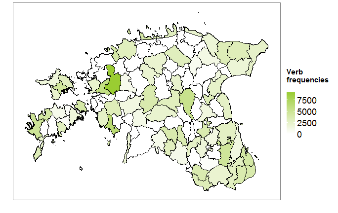

Another way to proceed. Merge the linguistic data and parish centroids data.


```r
verbsWithParishCentr <- merge(parishVerbFreq, centrPar.id, by.x="Parish_id", by.y="id")
head(verbsWithParishCentr)
```

```
##   Parish_id VerbFreqParish Longitude Latitude
## 1       Amb           3100  25.80704 59.24703
## 2       Ans           2427  22.22324 58.15741
## 3       Avi           1494  26.85259 58.99626
## 4       Emm           2281  22.56141 58.76610
## 5       Har           3313  26.46221 57.62186
## 6       Hel           1045  25.86460 57.99153
```

And we can also plot numbers (frequencies of verbs) on the map.


```r
ggplot(data = estParishesVerbsDF, aes(x = long, y = lat, fill = VerbFreqParish, group=group)) +
          geom_polygon(colour = "black") +
          scale_fill_gradient(low = "white", high = "yellowgreen", name = "Verb\nfrequencies\n") +
          labs(x = "", y = "") +
          theme_bw() +
          mapAxisTheme + 
          theme(legend.text=element_text(size=18), legend.title = element_text(size=15, face="bold")) +
          geom_text(data = verbsWithParishCentr, aes(x = Longitude, y = Latitude, label = VerbFreqParish), size = 3, inherit.aes=FALSE)
```

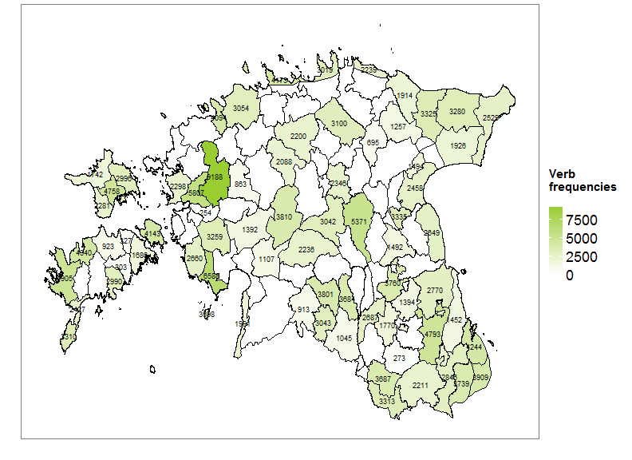

We can do the same for dialects. We read in the verb frequency data from the file *dialect-verb-frequencies.csv*.


```r
dialectVerbFreq <- read.csv2(file="dialect-verb-frequencies.csv")
head(dialectVerbFreq)
```

```
##        Dialect VerbFreqDial
## 1 Northeastern        11060
## 2      Eastern         9936
## 3          Mid        30161
## 4      Western        35568
## 5        Mulgi        12486
## 6      Coastal        11345
```

We can


1. join the same data with the initial dataframe;
2. join the new frequency data with previously created dataframe, which already contains parish frequency infromation;
3. join the new frequency data with the dialect dataframe;


Here we continue with the second option.
As we do not have dialect areas with zero or missing values, we can skip the value replacement steps.


```r
dialectsVerbsDF <- arrange(merge(estParishesVerbsDF, dialectVerbFreq, by.x="Dialect_en", by.y="Dialect", all.x=T, all.y=T, sort=F), order)
head(dialectsVerbsDF)
```

```
##   Dialect_en Parish_id OBJECTID ID  Name Ger_name
## 1        Mid       Amb       29 29 Ambla    Ampel
## 2        Mid       Amb       29 29 Ambla    Ampel
## 3        Mid       Amb       29 29 Ambla    Ampel
## 4        Mid       Amb       29 29 Ambla    Ampel
## 5        Mid       Amb       29 29 Ambla    Ampel
## 6        Mid       Amb       29 29 Ambla    Ampel
##                                                                          Comment
## 1 Kihelkonnapiirid mõisapiiride järgi üle kontrollitud (Peeter Päll, 2012-11-19)
## 2 Kihelkonnapiirid mõisapiiride järgi üle kontrollitud (Peeter Päll, 2012-11-19)
## 3 Kihelkonnapiirid mõisapiiride järgi üle kontrollitud (Peeter Päll, 2012-11-19)
## 4 Kihelkonnapiirid mõisapiiride järgi üle kontrollitud (Peeter Päll, 2012-11-19)
## 5 Kihelkonnapiirid mõisapiiride järgi üle kontrollitud (Peeter Päll, 2012-11-19)
## 6 Kihelkonnapiirid mõisapiiride järgi üle kontrollitud (Peeter Päll, 2012-11-19)
##   Problem Shape_Leng Shape_Le_1 Shape_Area Dialect_et Parish_id.1
## 1    <NA>   138573.8   137672.9  615672216       Kesk        <NA>
## 2    <NA>   138573.8   137672.9  615672216       Kesk        <NA>
## 3    <NA>   138573.8   137672.9  615672216       Kesk        <NA>
## 4    <NA>   138573.8   137672.9  615672216       Kesk        <NA>
## 5    <NA>   138573.8   137672.9  615672216       Kesk        <NA>
## 6    <NA>   138573.8   137672.9  615672216       Kesk        <NA>
##   Dialect_en.1 VerbFreqParish     long      lat order  hole piece group
## 1         <NA>           3100 25.75987 59.38331     1 FALSE     1 Amb.1
## 2         <NA>           3100 25.76030 59.38310     2 FALSE     1 Amb.1
## 3         <NA>           3100 25.76066 59.38274     3 FALSE     1 Amb.1
## 4         <NA>           3100 25.76107 59.38251     4 FALSE     1 Amb.1
## 5         <NA>           3100 25.76141 59.38219     5 FALSE     1 Amb.1
## 6         <NA>           3100 25.76145 59.38192     6 FALSE     1 Amb.1
##   VerbFreqDial
## 1        30161
## 2        30161
## 3        30161
## 4        30161
## 5        30161
## 6        30161
```

And we can now plot dialect frequency information.


```r
ggplot(data = dialectsVerbsDF, aes(x = long, y = lat, group = group, fill = VerbFreqDial)) +
          geom_polygon() +
          geom_polygon(colour = 'grey', alpha = .4, size = .1, show.legend=FALSE) +
          scale_fill_gradient(low = "white", high = "yellowgreen", name = "Verb frequencies\n") +
          labs(x = "", y = "") +
          theme_bw() +
          mapAxisTheme +
          theme(legend.text=element_text(size=18), legend.title = element_text(size=20, face="bold"))
```

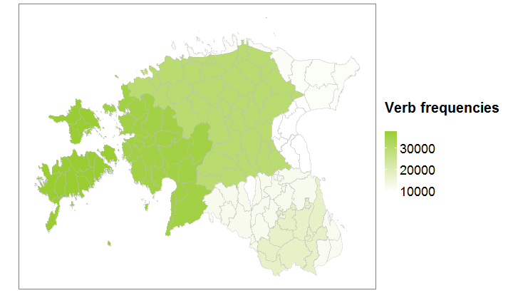

Plotting specific locations. Latitude and longtitude information is needed in a separate dataframe. Addtionally we plot dialect names on the corresponding areas with uppercase letters.


```r
myLocations <- read.csv("my-locations.csv", sep=";", header=T)
head(myLocations)
```

```
##          Place      lat      lon
## 1     Halliste 58.16408 25.43946
## 2 Harju-Madise 59.26735 24.31887
## 3      Hiiumaa 58.92395 22.59195
## 4  Häädemeeste 58.07962 24.49871
## 5       Iisaku 59.09981 27.31126
## 6       Karksi 58.11620 25.58565
```


```r
centroidsDial$Latitude[centroidsDial$Dialect=="Mulgi"] = centroidsDial$Latitude[centroidsDial$Dialect=="Mulgi"]+0.1 # move the centroid point of Mulgi dialect to avoid overlapping with other locations.
ggplot(data = dialect.df, aes(x = long, y = lat)) +
          geom_polygon(aes(group = group , fill = Dialect_en), colour = 'black',
                       alpha = .4,
                       size = .1,
                       show.legend=FALSE) +
          scale_fill_brewer(palette="Set3", guide=FALSE) +
          labs(x = "", y = "") +
          theme_bw() +
          mapAxisTheme +
          geom_text(data = myLocations, aes(x = lon, y = lat, label = Place), size = 4) +
          geom_text(data = centroidsDial, aes(x = Longitude, y = Latitude, label = toupper(Dialect)), size = 5.5)
```

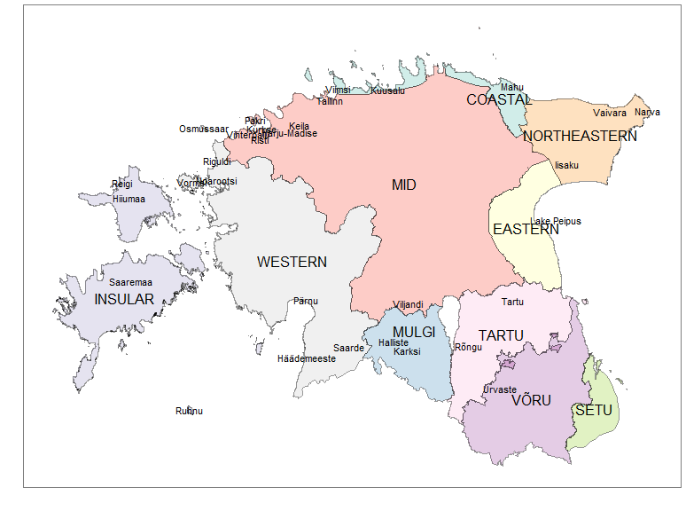

Now we plot the density map based on the same verb frequencies, but counted by dialects. First, we need to read in the information with village coordinates in a separate file. Then we read in the frequency information with village verb frequencies


```r
villageCoordinates <- read.csv(file = "village-coordinates.csv", sep=";")
villageVerbFreq <- read.csv(file = "village-verb-frequencies.csv", sep=";")
```

Add the column with dialect names in English (the initial dataframe only contains Estonian dialect names).


```r
villageCoordinates <- mutate(villageCoordinates, Dialect_en = ifelse(Dialect_et == "Ida", "Eastern",
                                                                     ifelse(Dialect_et == "Kesk", "Mid",
                                                                            ifelse(Dialect_et == "Lääne", "Western",
                                                                                   ifelse(Dialect_et == "Kirde", "Northeastern",
                                                                                          ifelse(Dialect_et == "Mulgi", "Mulgi",
                                                                                                 ifelse(Dialect_et == "Ranna", "Coastal",
                                                                                                        ifelse(Dialect_et == "Saarte", "Insular",
                                                                                                               ifelse(Dialect_et == "Setu", "Setu",
                                                                                                                      ifelse(Dialect_et == "Tartu", "Tartu",
                                                                                                                             ifelse(Dialect_et == "Võru", "Võru", "NA")))))))))))
```

Merge these two tables, by village and parish, because the same village name can occur in several parishes.


```r
villageFreqCoord <- merge(villageCoordinates, villageVerbFreq, by=c("Village", "Parish_id"))
head(villageFreqCoord)
```

```
##     Village Parish_id Dialect_et      lon      lat Dialect_en
## 1     Aakre       Rõn      Tartu 26.19000 58.09000      Tartu
## 2     Abula       Mus     Saarte 22.14440 58.44000    Insular
## 3  Anseküla       Ans     Saarte 22.23000 58.09000    Insular
## 4  Arisvere       Plt       Kesk 26.02972 58.78250        Mid
## 5   Aruküla       Pal        Ida 26.50278 58.66417    Eastern
## 6 Assikvere       Kod        Ida 26.96000 58.72000    Eastern
##   VillageVerbFreq
## 1             445
## 2             119
## 3            1072
## 4             478
## 5            1484
## 6             131
```

First, we modify the dataframe by converting it to long format by repeating village frequency values.


```r
longVillageFreqs <- expandRows(villageFreqCoord, "VillageVerbFreq")
```


```r
head(longVillageFreqs)
```

```
##     Village Parish_id Dialect_et   lon   lat Dialect_en
## 1     Aakre       Rõn      Tartu 26.19 58.09      Tartu
## 1.1   Aakre       Rõn      Tartu 26.19 58.09      Tartu
## 1.2   Aakre       Rõn      Tartu 26.19 58.09      Tartu
## 1.3   Aakre       Rõn      Tartu 26.19 58.09      Tartu
## 1.4   Aakre       Rõn      Tartu 26.19 58.09      Tartu
## 1.5   Aakre       Rõn      Tartu 26.19 58.09      Tartu
```

We use Google map as a base layer.


```r
est.map <- get_map(location = "estonia", zoom = 7, source = "google")
ggmap(est.map)
```

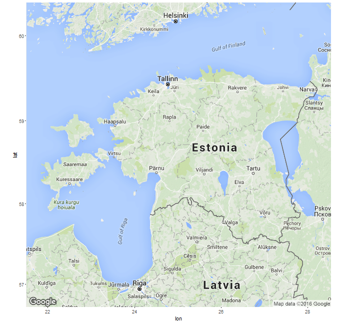

Plotting the density map with village verb frequencies.


```r
ggmap(est.map, extent = "panel", maprange=FALSE) +
          geom_density2d(data = longVillageFreqs, aes(x = lon, y = lat)) +
          stat_density2d(data = longVillageFreqs, aes(x = lon, y = lat,  fill = ..level.., alpha = ..level.., show.legend=FALSE), size = 0.01, geom = 'polygon') +
          scale_fill_gradient(low = "green", high = "red", guide=FALSE) +
          scale_alpha(range = c(0.00, 0.25), guide = FALSE) +
          labs(x = "", y = "") +
          mapAxisTheme
```

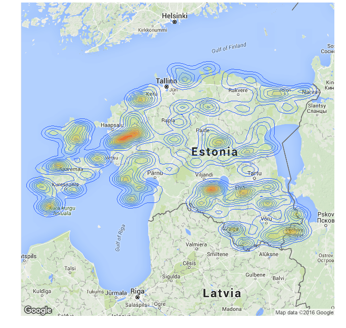

We can also plot the locations of data collection points. We use previously retrieved Google map as a base layer.


```r
ggmap(est.map) +
          geom_point(data = villageCoordinates, aes(x = lon, y = lat), size=2) +
          labs(x = "", y = "") +
          mapAxisTheme
```

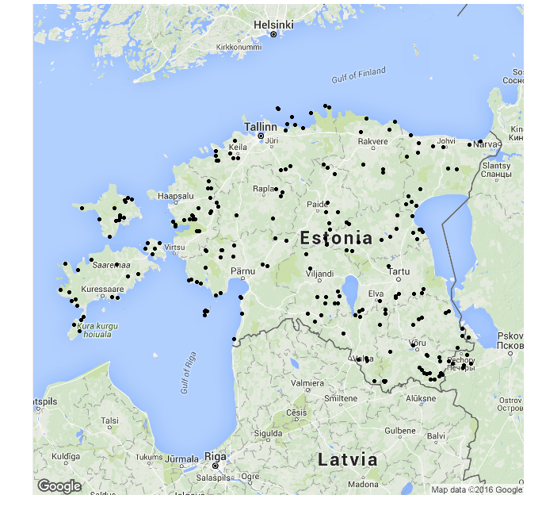

We can also plot the villages based on the frequencies of verbs, so that larger dots mark higher verb frequency.


```r
ggmap(est.map) +
        geom_point(data = villageFreqCoord, aes(x = lon, y = lat, size=VillageVerbFreq)) +
        scale_size_continuous(range=c(1,6), name="Verb frequencies") +
        labs(x = "", y = "") + 
        mapAxisTheme +
        theme(legend.text=element_text(size=18), legend.title = element_text(size=15, face="bold"))
```

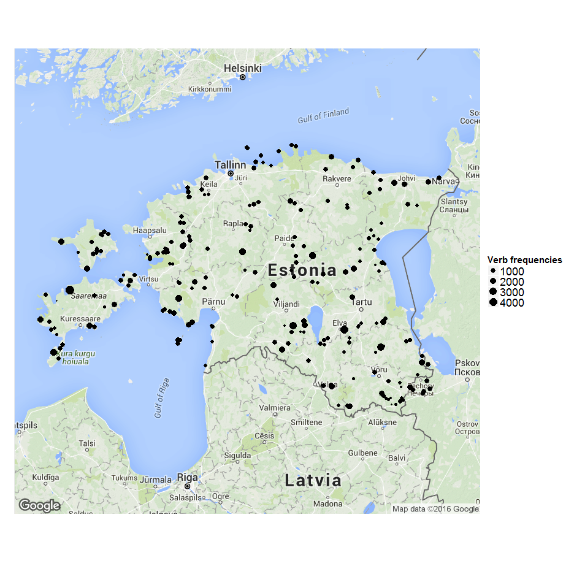

Now we use the data of case frequencies based on how they occur with adpositions in Estonian dialects.


```r
adpCase <- read.csv("adp-case.csv", sep=";", header=T)
```


```r
head(adpCase)
```

```
##   Dialect_et abe ade ela  gen kom nom par
## 1        IDA  17   4  15 1153   7   6  48
## 2       KESK  17  10  14 1148   4   3  75
## 3      KIRDE   9   0  18  895   0   0 100
## 4      LÄÄNE  19   5  23 1297   2   4  68
## 5      MULGI  14   0  21  906   7   1  71
## 6      RANNA  19   0  10 1121   3   0  86
```

First, we need to change the uppercase dialect names in Estonian into capitalized version (like in the shapefile). Then we change dialect names back to factors.


```r
adpCase$Dialect_et <- as.factor(stri_trans_general(adpCase$Dialect_et, id = "Title"))
```

Now we merge the dataframe (*adpCase*) with case frequencies and the previously created shapefile dataframe.


```r
dialectsAdpCaseDF <- arrange(merge(estParishesVerbsDF, adpCase, by.x="Dialect_et", all.x=T, all.y=T, sort=F), order)
```

And we can now plot dialect frequency information.


```r
partPlot <- ggplot(data = dialectsAdpCaseDF, aes(x = long, y = lat, group = group, fill = par)) +
          geom_polygon() +
          geom_polygon(colour = 'grey', alpha = .4, size = .1, show.legend=FALSE) +
          scale_fill_gradient(low = "white", high = "yellowgreen", name="") +
          labs(x = "", y = "") +
          theme_bw() +
          mapAxisTheme +
          theme(legend.text=element_text(size=18), legend.title = element_text(size=20, face="bold")) +
          annotate("text", x = 22.5, y = 59.75, label = "Partitiiv", size=5, fontface="bold")

genPlot <- ggplot(data = dialectsAdpCaseDF, aes(x = long, y = lat, group = group, fill = gen)) +
          geom_polygon() +
          geom_polygon(colour = 'grey', alpha = .4, size = .1, show.legend=FALSE) +
          scale_fill_gradient(low = "white", high = "yellowgreen", name="") +
          labs(x = "", y = "") +
          theme_bw() +
          mapAxisTheme +
          theme(legend.text=element_text(size=18), legend.title = element_text(size=20, face="bold")) +
          annotate("text", x = 22.5, y = 59.75, label = "Genitiiv", size=5, fontface="bold")

abePlot <- ggplot(data = dialectsAdpCaseDF, aes(x = long, y = lat, group = group, fill = abe)) +
          geom_polygon() +
          geom_polygon(colour = 'grey', alpha = .4, size = .1, show.legend=FALSE) +
          scale_fill_gradient(low = "white", high = "yellowgreen", name="") +
          labs(x = "", y = "") +
          theme_bw() +
          mapAxisTheme +
          theme(legend.text=element_text(size=18), legend.title = element_text(size=20, face="bold")) +
          annotate("text", x = 22.5, y = 59.75, label = "Abessiiv", size=5, fontface="bold")


adePlot <- ggplot(data = dialectsAdpCaseDF, aes(x = long, y = lat, group = group, fill = ade)) +
          geom_polygon() +
          geom_polygon(colour = 'grey', alpha = .4, size = .1, show.legend=FALSE) +
          scale_fill_gradient(low = "white", high = "yellowgreen", name="", breaks=c(0, 5, 10)) +
          labs(x = "", y = "") +
          theme_bw() +
          mapAxisTheme +
          theme(legend.text=element_text(size=18), legend.title = element_text(size=20, face="bold")) +
          annotate("text", x = 22.5, y = 59.75, label = "Adessiiv", size=5, fontface="bold")

elaPlot <- ggplot(data = dialectsAdpCaseDF, aes(x = long, y = lat, group = group, fill = ela)) +
          geom_polygon() +
          geom_polygon(colour = 'grey', alpha = .4, size = .1, show.legend=FALSE) +
          scale_fill_gradient(low = "white", high = "yellowgreen", name="") +
          labs(x = "", y = "") +
          theme_bw() +
          mapAxisTheme +
          theme(legend.text=element_text(size=18), legend.title = element_text(size=20, face="bold")) +
          annotate("text", x = 22.5, y = 59.75, label = "Elatiiv", size=5, fontface="bold")

komPlot <- ggplot(data = dialectsAdpCaseDF, aes(x = long, y = lat, group = group, fill = kom)) +
          geom_polygon() +
          geom_polygon(colour = 'grey', alpha = .4, size = .1, show.legend=FALSE) +
          scale_fill_gradient(low = "white", high = "yellowgreen", name="") +
          labs(x = "", y = "") +
          theme_bw() +
          mapAxisTheme +
          theme(legend.text=element_text(size=18), legend.title = element_text(size=20, face="bold")) +
          annotate("text", x = 22.5, y = 59.75, label = "Komitatiiv", size=5, fontface="bold")

grid.arrange(partPlot, genPlot, abePlot, adePlot, elaPlot, komPlot, nrow=3, ncol=2)
```

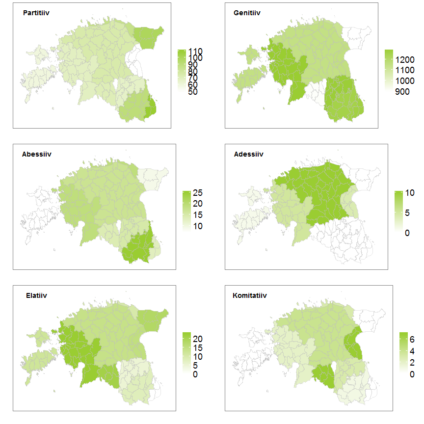

We can also combine Google maps and shapefile.


```r
ggmap(est.map) +
          geom_polygon(data=dialect.df, aes(x=long, y=lat, group=group, fill=Dialect_en), colour='white', alpha=.2, size =.4, show.legend=F) +
          geom_polygon(data=parish.df, aes(x=long, y=lat, group=group), colour='black', fill='white', alpha=.2, size=.1, show.legend=F) +
          labs(x = "", y = "") +
          theme_bw() +
          mapAxisTheme
```

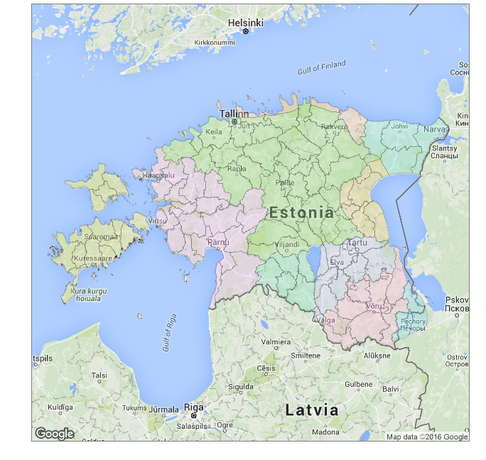


